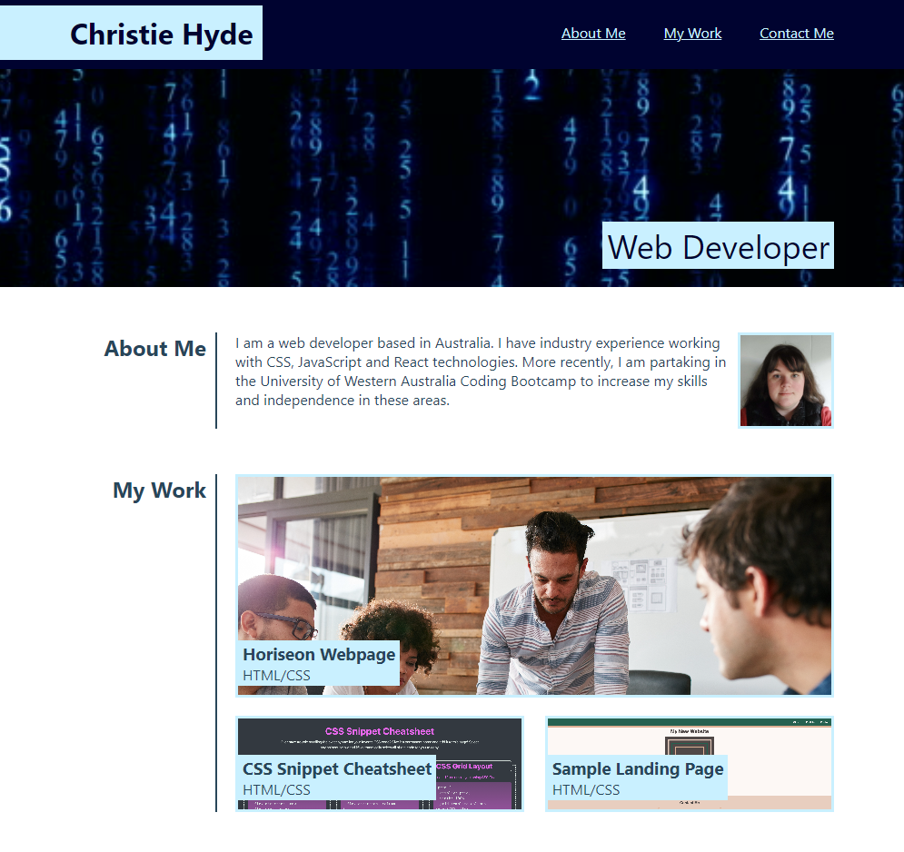

# Christie Hyde's Portfolio
## Description

This project is a webpage containing an online portfolio for Christie Hyde (myself). It has been created to neatly and dynamically demonstrate my previous work as a web developer in a format that is easily accessible by future employers.

## Installation

The webpage is hosted online and can be accessed using the following link: https://christiehyde.github.io/WebPortfolio/

## Usage

A screenshot of the webpage is provided:

Users can navigate the webpage using the scroll bar, or can click on a link in the navigation bar to jump to that section of the webpage.

In the "My Work" section, users can click on a portfolio card to navigate to the webpage that that project is hosted at. Currently only the first card ("Horiseon Webpage") contains a link.

In the "Contact Me" section, users can click on the links to navigate to the pages from those sites. Currently only the Github page is linked.

The webpage is size-responsive and will adapt to mobile-friendly layouts on smaller-sized screens.

## Credits
All HTML and CSS code was written by Christie Hyde for this project.

## Disclaimer
The following images were outsourced for this webpage:
* Hero Image: https://www.istockphoto.com/video/blue-digital-matrix-rain-seamless-loop-animation-gm588650386-101964419 (still image obtained from Google Images preview)
* Horiseon Page Preview: From University of Western Australia Coding Boot Camp Challenge 1 files
* CSS Snippet Cheatsheet Preview and Sample Landing Page Preview: From University of Western Australia Coding Bootcamp: Specifications for Mini-Project Week 2 and Mini-Project Week 1